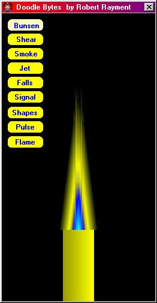



## Doodle Bytes \(Updated\)

### Description

Doodle Bytes by Robert Rayment. (Updated) This shows a variety of animations using the technique of drawing to a byte array and blitting to the screen with a palette. Win98 (exe WinXP) 14 KB.
 
### More Info
 
Jusr run

             |
---                |---
**Submitted On**   |2003-05-20 09:59:36
**By**             |[Robert Rayment](https://github.com/Planet-Source-Code/PSCIndex/blob/master/ByAuthor/robert-rayment.md)
**Level**          |Beginner
**User Rating**    |4.7 (66 globes from 14 users)
**Compatibility**  |VB 6\.0
**Category**       |[Graphics](https://github.com/Planet-Source-Code/PSCIndex/blob/master/ByCategory/graphics__1-46.md)
**World**          |[Visual Basic](https://github.com/Planet-Source-Code/PSCIndex/blob/master/ByWorld/visual-basic.md)
**Archive File**   |[Doodle\_Byt1590325212003\.zip](https://github.com/Planet-Source-Code/robert-rayment-doodle-bytes-updated__1-45574/archive/master.zip)

### API Declarations

StretchDIBits & others

